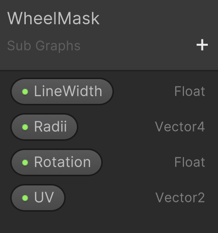
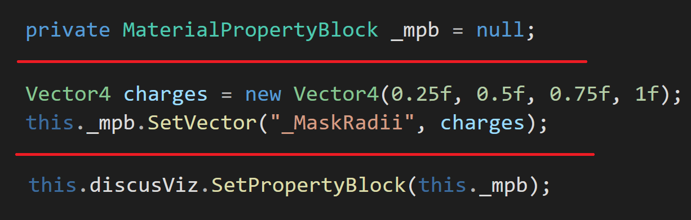

# WheelShader
A Unity URP/HDRP ShaderGraph for making that wheel. You know the one.

The *WheelMask* shader graph creates the wheel; quadrents with individual radii, all configurable from properties.

## Properties

## Scripting Example

Setting the weights for each quadrant can be done directly on the material or programmetically via the example shown below. Note that *discusViz* is a reference to the MeshRenderer that has this shader/material. 

